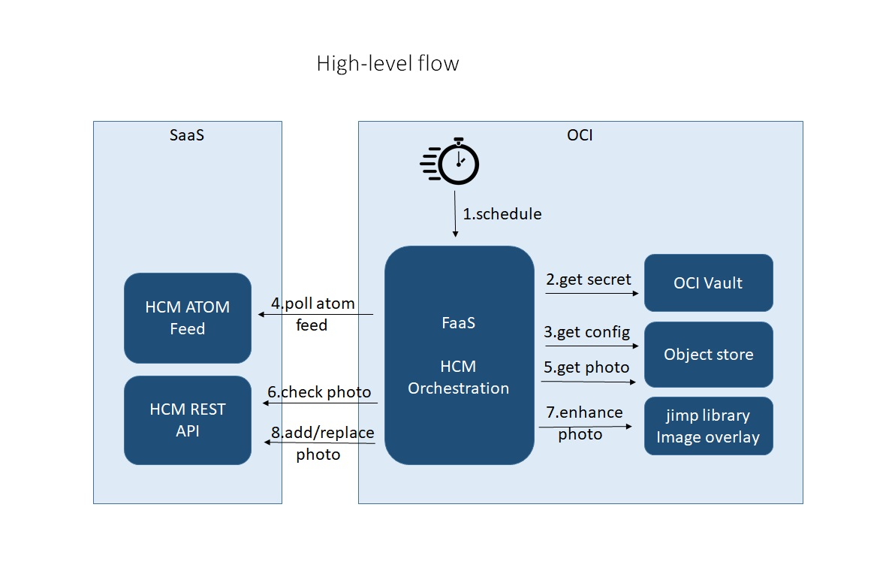

# Oracle Human Capital Management Worker Profile Photo Loader
This repository contains code for an application built on [Oracle Cloud Infrastructure (OCI)](https://www.oracle.com/cloud/) using Oracle Functions and NodeJS to integrate with Oracle Human Capital Management Cloud. 

## Background

[Oracle Cloud Infrastructure (OCI)](https://www.oracle.com/cloud/) offers tools and platforms to easily extend and integrate with Oracle SaaS applications. HCM Atom feeds provide the mechanism to get important updates from transactions in Human Capital Management cloud and perform relevant actions. This example demonstrates how to consume Atom feeds and orchestrate steps for integration using NodeJS in Oracle Functions. 

For each new hire added to Human Capital Management cloud through UI, REST API, or HCM Data Loader (HDL) import, Human Capital Management cloud generates an entry in the new hire Atom feeds. This feed can be queried by external applications, for example, to add a user account for the new hire in the enterprise identity management system. 

For this solution, let us assume a scenario where workers are migrated from a 3rd party HR application to Oracle HCM cloud. The employee profile photos are stored in object storage. This solution will locate the profile photo for each employee, apply company logo as background image and then add the photo as profile photo to HCM cloud. The logic implemented by this solution can easily be modified for other purposes. 

Here is the high-level flow of the solution.  



This solution is designed to be run as a scheduled job. Scheduling aspects of the job is left to prospective users of the solution. A simple way to invoke the function is shown in “Run the code” section below. 
 
Here is the sequence of actions performed by this solution.
1. Start-up parameters are supplied as JSON payload to the  scheduled job, as shown in the example below. 
    ```
    {
        "bucket":"<Name of Object Storage bucket that stores configuration>",
        "object":"config.json",
        “namespace":"<Namespace of Oracle Cloud Infrastructure tenancy>",
        "hostname":"secrets.vaults.<OCI-REGION>.oci.oraclecloud.com",
        "compartmentOcid":"<OCID of compartment that has the vault with secrets>",
        "secretOcid":"<OCID of secret>",
        "hcmhostname":"xyzd.fa.us6.oraclecloud.com"
    }
    ```
    The credential required to access HCM Cloud is stored in a secret in a vault. The OCI IDs (OCID) for compartment and secret are provided in start-up parameters, as shown. Configuration in the file named "config.json", is stored encrypted in object storage. Access to the configuration file and secret are secured through OCI Resource principal authentication, which ensures that only the function can access the resources. OCI IAM policies are used to define resource principal authentication. Refer to documentation provided in "References" section for more information. 

    The stored secret is a basic or token credential that can be passed to HCM API calls.

    This sample uses config.json from Object Storage, which has the date and time stamp of the latest Atom feed observed in the previous run.  This date and time stamp is used to query newer new hire updates in the next run. Here is a sample config.json. At the end of a run, this sample updates config.json with newer date and time stamp observed from Atom feeds.

    ```
    {
        "lastfeedtime":"2016-03-18T15:55:33.652Z"
    }
    ```

1. Fetch Atom feed from Human Capital Management Cloud - HCM Atom feeds are accessible over REST endpoint. This solution queries new hire ATOM feed with update date and time later than a date and time obtained from config.json.
1. For each new hire in Atom feed, perform these actions.
    1. Look for a profile photo in OCI object store, with name as the new hire's person number
    1. If there is no photo available, fetch an object named "defaultPhoto". This is a blank image that will be used when a new hire
       does not have an image in object store. 
    1. Apply enhancements to the photo, using a 3rd party library "Jimp". In this example, we apply a simple text overlay over
       the profile photo.
    1. Find the internal identifier for the new hire from Human Capital Management cloud, by looking up the new hire using Worker API. This identifier 
       is used to formulate the REST API URL for subsequent operations.
    1. Query Human Capital Management REST endpoint to find whether there is a profile photo already existing for the new hire. If there is a profile
       photo, delete the photo.
    1. Add the enhanced photo as profile photo in Human Capital Management cloud
1. Note the latest observed "updated" date time in ATOM feed and update config.json.
1. Exit the function    

A developer looking to repurpose this sample must be proficient in both OCI Functions and NodeJS. Check the references section below for links to get started on both. Here are the files in the sample, with an explanation of each one's purpose.

**func.js** - This is the entry point for a function. Every Oracle function written with NodeJS must have a func.js and optionally other JavaScript modules. For this sample, this function is a simple sequence of calls to JavaScript functions in other modules. 

**objectStorage.js** - This module implements all Object Storage related functions for the sample.

**api.js**  - This module implements the code orchestration logic for the integration. It also deals with all Human Capital Management REST API calls.

**vault.js**  - This module implements the functions to fetch secrets from Oracle Cloud Infrastructure Vault.

**func.yaml** - This file in generated by *fn* command and contains metadata about the function and declares a number of properties. It has not been modified for this sample.

**package.json** - This is the manifest file for NodeJS projects. Among other purposes, it lists all the dependencies that need to be installed before the project is run by NodeJS. This file has been modified to include dependencies. *Jimp* image-processing library is the only 3rd party dependency for this sample. 

## Dependencies

This example requires the following to test:
- Oracle Human Capital Management cloud. A user account with privileges to access Atom REST API and read and write access to Worker API. Data security privileges might also be necessary, depending on Human Capital Management configuration. Check "References" section for information about Human Capital Management REST API Security.
- Access to Oracle Cloud Infrastructure (OCI) tenancy and permissions to define IAM policies, create functions and, to create objects in Object Storage.

## Third Party Dependencies

Developers choosing to distribute a binary implementation of this project are responsible for obtaining and providing all required licenses and copyright notices for the third-party code used in order to ensure compliance with their respective open source licenses.

The following libraries are required for this code to run. 
- **Oracle Cloud Infrastructure SDK for TypeScript and JavaScript**, available under UPL 1.0, at https://www.npmjs.com/package/oci-sdk 
- **jimp**, a npm package for image processing, available under MIT license, at https://www.npmjs.com/package/jimp
- **@fnproject/fdk**, a npm package, available under Apache-2.0 license, at https://www.npmjs.com/package/@fnproject/fdk
- **http-signature** a npm package, available under MIT license, at https://www.npmjs.com/package/http-signature
 
## High Level Steps To Use The Code

The function in this sample code can be run from command line, using *fn* command on Linux shell. Refer to "References" section below for documentation or blogs for other possible ways to invoke functions.

### Deploy The Code

- Setup your OCI tenancy as the default context for fn deployment.  Refer Oracle functions documentation provided in "References" section. Then, run this command and make sure that the context is listed.
```
fn list contexts  - Make sure default context is selected
```
- Create a new function *hcmProfilePhotoLoader*, with node as runtime. Then, create a new application for this function.
```
fn init --runtime node hcmProfilePhotoLoader
cd hcmProfilePhotoLoader
fn create app hcmapp --annotation oracle.com/oci/subnetIds='["ocid1.subnet.oc1.phx..."]'
```
- Download the files *func.js*, *objectStorage.js*, *api.js*, *vault.js*, *func.yaml* and *package.json* from Github repository and copy the files to function directory *hcmProfilePhotoLoader*. If any of these files already exist, replace them.  

- Deploy the app and verify that it is deployed. Once deployed, perform configuration steps such as enabling logs or setting custom timeouts, in OCI console. 
``` 
fn deploy --verbose --app hcmapp  
fn list apps “List the deployed apps”
```
### Configure OCI Security 

OCI IAM policies should be configured so that only this function can access the objects in the Object Storage bucket and the secret specified in start-up parameters. Next section explains the use of Object Storage.

OCI IAM policies will enable *Resource principal authentication* for the function. This step is necessary to ensure that no other persons or applications will have access to the secret, configuration file and photos. Please refer to a blog about how to use it from JavaScript, listed under "References" section below. There is also a link to OCI documentation on resource principal authentication.

### Configure Object Storage

Create an Object Storage bucket that will be accessible only by the function that uses this sample code. 

This Object Storage bucket will have *config.json* file and profile photos for all new hires named after their person numbers (without file extensions such as .jpg) and a default profile photo named *defaultPhoto*, which will be used if a new hire does not have a profile photo in Object Storage.

### How to Run

To run the code from Linux command line, make sure that the OCI CLI environment is configured and added to local *fn* deployment as the default context. Then, run this command to invoke the function. 
```
echo -n '<start-up parameters as JSON>' | fn invoke hcmapp hcmProfilePhotoLoader 

```
The other option is to expose the function through OCI API gateway, and then to invoke the API gateway REST endpoint. 

## References

[Oracle functions reference.](https://www.oracle.com/cloud-native/functions/)

[Oracle Human Capital Management REST API reference.](https://docs.oracle.com/en/cloud/saas/human-resources/21b/farws/index.html)

[Oracle Human Capital Management ATOM feeds.](https://docs.oracle.com/en/cloud/saas/human-resources/21b/farws/Working_with_Atom.html)

[How to configure Resource principal Authentication for functions?](https://docs.oracle.com/en-us/iaas/Content/Functions/Tasks/functionsaccessingociresources.htm)

[Blog on configuring Oracle Human Capital Management REST API security.](https://www.ateam-oracle.com/enforcing-role-based-data-security-over-hcm-cloud-rest-api-a-worked-example)

[Blog on Oracle Cloud Infrastructure Resource principal authentication for JavaScript.](https://blogs.oracle.com/developers/instance-and-resource-principal-authentication-with-the-oci-typescriptjavascript-sdk)

[How to add API gateway as a frontend to functions?](https://docs.oracle.com/en-us/iaas/Content/APIGateway/Tasks/apigatewayusingfunctionsbackend.htm)

[A blog that shows how to securely configure API gateway for functions.](https://www.ateam-oracle.com/bicc-securing-extract-logs-rest-services)


## Contributing

This project welcomes contributions from the community. Before submitting a pull request, please [review our contribution guide](./CONTRIBUTING.md)

## Security

Please consult the [security guide](./SECURITY.md) for our responsible security vulnerability disclosure process

## Help

Visit Oracle Cloud Customer Connect Community at [Oracle Cloud Customer Connect](https://cloudcustomerconnect.oracle.com) for additional resources and FAQs. 

## License
Copyright (c) 2022, 2023 Oracle and/or its affiliates. 

Released under the Universal Permissive License v1.0 as shown at
<https://oss.oracle.com/licenses/upl/>.
